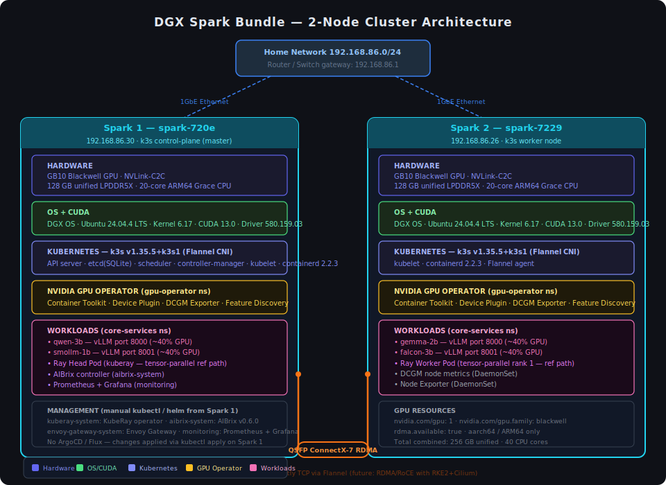

# Chapter 1 — Introduction: What You Are Building

## The DGX Spark Bundle

The NVIDIA DGX Spark Bundle is two DGX Spark personal AI supercomputers sold together with everything needed to link them into a single distributed cluster. Each Spark is a self-contained machine with a Grace Blackwell GB10 GPU, 128GB of unified CPU-GPU memory, and a 20-core ARM64 CPU — all in a compact desktop form factor.

When you connect two Sparks over QSFP and configure them as a cluster, you get:

| Resource | Per Spark | Combined |
|----------|-----------|----------|
| GPU | 1× NVIDIA GB10 Blackwell | 2× GPUs |
| GPU Memory | 128GB unified | 256GB unified |
| CPU Cores | 20 (ARM64) | 40 cores |
| Interconnect | — | ConnectX-7 RDMA (QSFP) |
| OS | DGX OS (Ubuntu 24.04.4 LTS) | — |

This combined system can load and serve language models that would not fit on either GPU alone — models with tens or hundreds of billions of parameters — by splitting weights across both GPUs using tensor parallelism.

> **Architectural Insight: What "unified memory" actually means**
>
> On conventional GPU servers, the CPU has its own DRAM and the GPU has its own GDDR or HBM. Moving data between them costs a PCIe transfer — typically 16–32 GB/s and a round-trip latency measured in microseconds.
>
> On the DGX Spark, the Grace CPU and Blackwell GPU are connected via NVLink-C2C — a chip-to-chip interconnect embedded in the same module. Both processors share a single pool of LPDDR5X memory at up to 900 GB/s. There is no PCIe bus and no copy penalty. A tensor allocated in CPU memory is immediately visible to the GPU at the same address, at full bandwidth.
>
> This is why 128GB is the "GPU memory" — it is the total system memory, and all of it is available to GPU workloads. For LLM inference, this means you can load a 70B parameter model in fp16 (~140GB) across two Sparks without the weight-loading bottleneck that limits conventional GPU clusters.
>
> The ConnectX-7 QSFP cable is a separate interconnect for *cross-node* communication between the two Spark units. It is not NVLink — it is an RDMA-capable network interface used by NCCL for tensor parallel all-reduce operations.

## What You Will Have at the End

By the time you finish this book, you will have:

1. **Two DGX Spark nodes** connected physically and configured with static IPs, SSH, and Docker
2. **A 2-node k3s Kubernetes cluster** with Spark 1 as control plane and Spark 2 as worker
3. **NVIDIA GPU Operator** making both GB10 GPUs visible to Kubernetes
4. **KubeRay operator** installed as a reference path for large-model tensor parallelism
5. **vLLM** deployable in two patterns — per-model independent processes (active) or tensor-parallel across both GPUs (reference)
6. **AIBrix** routing AI agent requests to vLLM with multi-tenant isolation
7. **Prometheus + Grafana** monitoring the full stack including GPU metrics

The result is a production-ready AI inference platform that you own, control, and can extend.

## Two Deployment Patterns

The cluster supports two distinct ways to serve models with vLLM. Understanding the difference upfront will help you follow Chapters 5–6 with the right mental model.

| Pattern | When to use | How it works |
|---------|------------|-------------|
| **Independent per-model** (active) | Multiple small models, comparison/ensembling, research | Each model runs as its own vLLM process in `core-services`. Spark 1 and Spark 2 each host 1–2 models independently. No cross-node communication needed. |
| **Tensor-parallel via KubeRay** (reference) | One large model that exceeds 128GB | vLLM splits weight tensors across both GPUs using Ray. Both Sparks collaborate on every inference call. Used for models like Qwen3-235B or Llama 405B. |

**The active deployment** uses 4 independent small models:

```
Spark 1 (192.168.86.30)          Spark 2 (192.168.86.26)
├── qwen-3b  (vLLM process)       ├── gemma-2b  (vLLM process)
└── smollm-1b (vLLM process)      └── falcon-3b (vLLM process)
```

Each model is independently addressable. No Ray cluster is involved. This is simpler, more resilient, and the right choice for running several small models side by side.

**The tensor-parallel path** (Chapters 5–6) is documented as the setup to reach for when a single model's weights exceed one Spark's 128GB unified memory. KubeRay is installed on the cluster but is not the currently active inference route.

## Software Stack

The full software stack, from hardware up:

```
┌─────────────────────────────────────────────────────────────┐
│                    AI Applications / Agents                  │
├─────────────────────────────────────────────────────────────┤
│              AIBrix v0.6.0  (aibrix-system)                  │
│         Request routing · Multi-tenancy · GPU scheduling      │
├─────────────────────────────────────────────────────────────┤
│     vLLM 0.10.1.1  (core-services namespace)                 │
│      OpenAI-compatible API · Tensor Parallel across 2 GPUs   │
├─────────────────────────────────────────────────────────────┤
│         KubeRay  (kuberay-system)                            │
│         Ray 2.49.2 · 2-node distributed cluster              │
├─────────────────────────────────────────────────────────────┤
│         k3s v1.35.5  ·  Flannel CNI                         │
│         Kubernetes control plane + workload scheduler         │
├─────────────────────────────────────────────────────────────┤
│     NVIDIA GPU Operator  (gpu-operator namespace)            │
│   Container Toolkit · Device Plugin · DCGM Exporter          │
├─────────────────────────────────────────────────────────────┤
│     DGX OS (Ubuntu 24.04.4 LTS)  ·  Kernel 6.17             │
│         CUDA 13.0  ·  Driver 580.159.03                      │
├─────────────────────────────────────────────────────────────┤
│   Spark 1 (GB10, 128GB)  ←QSFP→  Spark 2 (GB10, 128GB)     │
│              ConnectX-7 RDMA interconnect                     │
└─────────────────────────────────────────────────────────────┘
```

## Cluster Architecture

<div align="center">
  
</div>

The diagram above shows the complete cluster: both Spark nodes, their hardware and software layers, the QSFP ConnectX-7 RDMA interconnect between them, and their connection to the home network. The color coding maps to the software stack: purple = hardware, green = OS/CUDA, indigo = Kubernetes, amber = GPU Operator, pink = active workloads.

## Kubernetes Namespace Layout

The cluster is organized into purpose-specific namespaces:

| Namespace | Purpose |
|-----------|---------|
| `kube-system` | k3s core — CoreDNS, metrics-server |
| `gpu-operator` | NVIDIA GPU management and visibility |
| `kuberay-system` | KubeRay operator (installed; reference path for large models) |
| `monitoring` | Prometheus + Grafana + AlertManager |
| `core-services` | Per-model vLLM deployments (primary active inference) |
| `aibrix-system` | AIBrix request routing and agent lifecycle |
| `envoy-gateway-system` | Envoy Gateway (AIBrix traffic layer) |
| `qqq-data` | Project workload (offline pipeline) |
| `fine-tune` | Project workload (real-time pipeline) |
| `snackonai` | Project workload (research agent pipeline) |

## Models You Can Serve

With 256GB of combined unified memory, the cluster can handle:

| Model | Parameters | GPU Memory Required | Notes |
|-------|-----------|---------------------|-------|
| Qwen2.5-7B-Instruct | 7B | ~14GB (bf16) | Default setup in this book; fits on one Spark |
| Qwen2.5-72B-Instruct | 72B | ~144GB (bf16) | Requires tensor parallelism across both Sparks |
| Qwen3-235B-A22B-NVFP4 | 235B (MoE) | ~120GB (NVFP4) | MoE architecture — active params ~22B per token |
| Nemotron-3-Super-120B | 120B | ~60–80GB (quantized) | Requires AWQ or int8 quantization |
| Llama 3.3 70B Instruct | 70B | ~140GB (bf16) | Fits across both Sparks with headroom |

> **Deep Dive: How quantization affects memory**
>
> Model memory = (parameter count) × (bytes per parameter).
> - float32 (fp32): 4 bytes/param → 7B model = 28GB
> - bfloat16 (bf16): 2 bytes/param → 7B model = 14GB
> - int8: 1 byte/param → 7B model = 7GB
> - NVFP4 (NVIDIA 4-bit): 0.5 bytes/param → 7B model = 3.5GB
>
> NVFP4 is NVIDIA's native 4-bit format for Blackwell. It is not the same as the community AWQ or GPTQ formats. NVFP4 models must be pre-quantized — vLLM supports loading them with `--quantization nvfp4` but cannot quantize on the fly at load time.
>
> For Mixture-of-Experts (MoE) models like Qwen3-235B, the stated 235B total parameters represent all expert weights. Only the "active" parameters (~22B) are computed per forward pass, which is why these models can run faster than dense 235B models despite the large memory footprint.

## Automated Setup

Once you have done this manually once, you can reproduce the full cluster from scratch using the automation script:

```bash
git clone https://github.com/mohinishbasha/dgx-spark-bundle.git
cd dgx-spark-bundle
bash books/from-box-to-cluster/script.sh \
  --spark1-ip 192.168.86.30 \
  --spark2-ip 192.168.86.26 \
  --spark2-user moonlit \
  --spark1-hostname spark-720e \
  --spark2-hostname spark-7229 \
  --hf-token <YOUR_HUGGINGFACE_TOKEN>
```

The script is idempotent — safe to re-run if a step fails partway through.

## Chapter Sequence

Complete these chapters in order:

| Order | Chapter | Time Estimate |
|-------|---------|---------------|
| 1 | This chapter | — |
| 2 | Hardware Setup and First Boot | 60–90 min |
| 3 | CUDA and System Updates | 30–60 min |
| 4 | Kubernetes with k3s | 20–30 min |
| 5 | KubeRay | 15–20 min |
| 6 | vLLM | 30–60 min (includes model download) |
| 7 | AIBrix | 10–15 min |
| 8 | Cluster Overview and Monitoring | 20–30 min |

**Total estimated time:** 3–5 hours for a complete setup on two fresh units.

---

*Continue to Chapter 2 to begin with hardware setup and first boot.*
